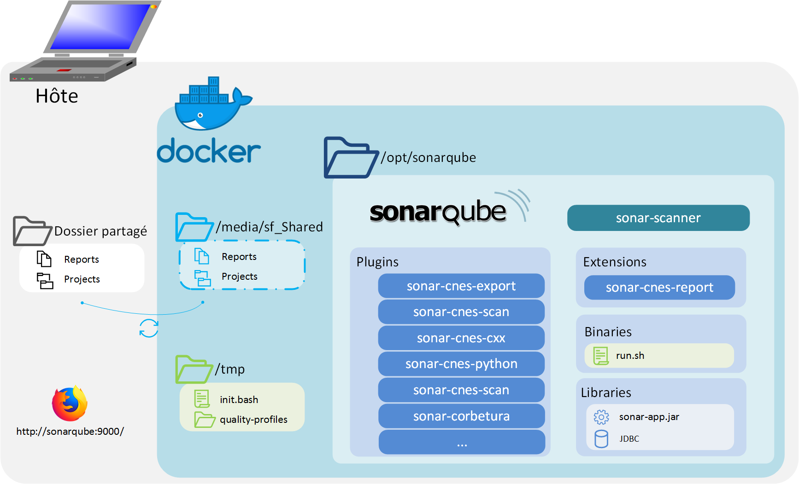
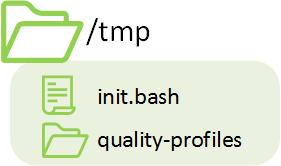

# Docker-CAT - technical guide

## Tools included
To see all tools included, you can directly check the 
[Dockerfile](https://github.com/lequal/docker-cat/blob/master/Dockerfile).


## Architecture
### Structure générale


There is 3 parts in the Docker-CAT:
- The *boot*: it contains configuration files and some scripts, it's located at `/tmp` in docker.
- *SonarQube*: The SonarQube software and the plugins, located at `/opt/sonarqube`.
- The Shared Folder: The place where you put the code to analyse, on docker, mounted on `/media/sf_Shared`.


### Boot


In the boot folder you can find the entry point of the docker and some quality profiles for SonarQube. This script authorize
SonarQube user to acces the Shared Folder.

### Application SonarQube


### Shared folder


When you start the docker, the user must choose a folder that will be accessible in docker (also see: 
[docker documentation](https://docs.docker.com/storage/volumes/)). This folder should have read/write access.

When this folder is updated by Docker, it will also update folder in the host, so when you stop docker, you will
not loose the results.

## Build
### Building image
This docker image is built from the sonarqube image. Then it will install some plugins and scripts. Because 
it use an official docker image, it's important to rebuild the image to include latest security updates from
sonarqube.


### Add plugins
If you want to add plugins into Docker-CAT, you can copy your jar file into `/opt/sonarqube/extensions/plugins`.
After that, if docker is running, restart it with `docker restart`

## Start docker
### Commandes
At first run, you can start docker with:
```
docker run \
  -p 9000:9000 -p 9001:9001 \
  -v <host_directory>:/media/sf_Shared:rw \
  -e ALLOWED_GROUPS="<GID>[;<GID2>;<GID3>;...]" \
  docker-cat
```

**Arguments:**

- `-p 9000:9000` Open port 9000 and redirect to port 9000 in Docker (used for HTTP).
- `-p 9001:9001` Open port 9001 and redirect to port 9001 in Docker (used for JDBC).
- `-v <host_directory>:/media/sf_Shared:rw` share the host folder by creating a new volume inside Docker.
- `-e ALLOWED_GROUPS="<GID>[;<GID2>;<GID3>;...]` create a new variable used by startup script. The user `sonarqube:sonarqube`
will be a member of all specified groups.

**About allowed `ALLOWED_GROUPS`**
In linux, every user have a UID (UserID) and one or more GID(GroupID). Because SonarQube is not run as root
(and should never be run as root), sonarqube should be in the same group as users that depose code. 
For example if *Alice* (UID=42;GID=1004) depose code on shared folder, Sonarqube have to be a member of group 1004
to read/update folder.


You can get GID by using: `getent group <group_name> | cut -d : -f3`.


### Docker-cat - Entry point
When you start Docker `init.bash` is runned
(`ENTRYPOINT ["/tmp/init.bash"]` in docker file). This script will:

- Configure GID and permissions for the user `sonarqube:sonarqube`.
- Start *Sonarqube*.
- Configure the *Quality profiles*.
- Create the *Quality gates*.


## Analyse code
To start a code analysis, juste use the cnes-scan plugin. For that, open the web interface (http://localhost:8000), click
on "More" > "CNES Analysis"

See also: [Plugin on github](https://github.com/lequal/sonar-cnes-scan-plugin).

### Fonctionnement
Lorsque l'analyse est lancée, plugin Sonar CNES Scan se charge d'écrire les
fichiers `sonar-properties` du projet indiqué, puis, ensuite d'ordonner au
[sonar-scanner](https://github.com/SonarSource/sonar-scanner-cli) de lancer
l'analyse sur le projet en question.

Au sein du conteneur, des liens symboliques ont été créé dans les différents
répertoires de l'installation SonarQube afin de correspondre aux paramètres
attendu par défaut. Par exemple, le répertoire `/opt/sonar` a un lien symbolique
vers `/opt/sonarqube`, l'actuelle installation de sonarqube.


## Arrêt du conteneur
### Commandes
Une fois le conteneur lancé, il peut-être arrêté grâce à la commande
`docker stop <nom_conteneur>` et redémarré avec la commande
`docker restart <nom_conteneur>`.

> **Rappel :** Pour pouvoir lancer les commandes docker, il faut que le docker deamon soit lancé (*en utilisant en `root` la commande `systemctl start docker`*). Il est aussi nécessaire qui lance le conteneur soit `root` ou appartienne au groupe `docker` (**attention**, faire partit du groupe `docker` revient à être `root` sur l'hôte).

### Persistance des données
L'arrêt simple du conteneur n'en supprime pas son contenu, ainsi lorsqu'il est
relancé grâce à la commande `restart` son état est identique à celui dans lequel
 il était au moment du `stop`.

Cela implique :
- Que la base de données garde à ce moment là les analyses lancées.

## Suppression du conteneur
Il est possible de supprimer de manière définitive le conteneur (et sa base de
données) grâce à la commande `docker rm <nom_conteneur>`.
