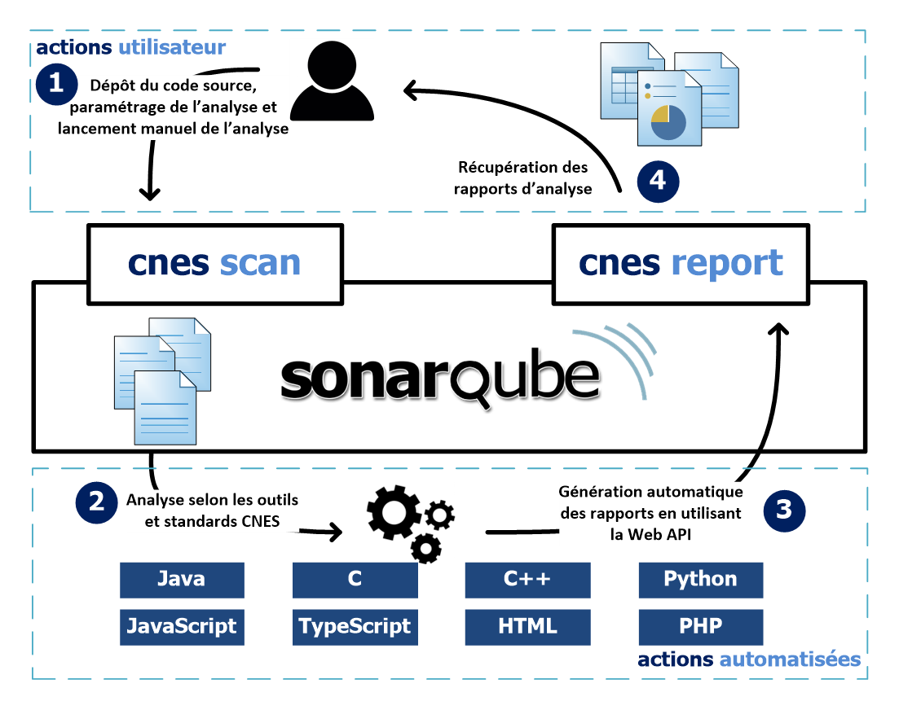
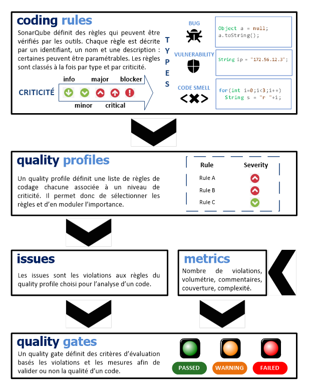

# La plateforme CAT

## Présentation
La solution CAT se base sur SonarQube pour offrir un outil intuitif est moderne.
Il est capable de réaliser une analyse de code sur les langages suivants:

- C++
- Java
- Python
- Web (HTML, JavaScript, TypeScript, PHP, etc.)

Son utilisation se fait de la manière suivante:
- 1: L'utilisateur dépose le code du projet dans un dossier partagé avec Docker.
- 2: Via l'interface web il accède au plugin [cnes-scan](https;//github.com/lequal/sonar-cnes-plugin)
- 3: Après avoir saisi quelques informations sur le projet, l'analyse se lance.
- 4: Les résultats sont disponibles dans SonarQube via l'interface web !
- 5: Si besoin, l'utilisateur exporte les rapports au format excel et docx via
  l'interface web, à l'aide de [cnes-report](https://github.com/lequal/sonar-cnes-report)

Le schéma ci-dessous résume l'utilisation de CAT.

## Architecture de SonarQube
La plateforme [SonarQube](https://www.sonarqube.org) est constitué de 4 composants
majeurs, à savoir:

- Le **serveur web**: qui agrège les informations sous forme de tableaux de bords
  destination des développeurs et/ou managers.
- La **base de données** qui stocke la configuration SonarQube mais égalements
  les différents rapports du projet.
- Les nombreux **plugins** installés sur le serveur pour l'analyse des différents
  languages de programation.
- Un (ou plusieurs) processus **SonarQube Scanner** sur le serveur de build
  pour analyser la qualité du code en continue.

Cela est résumé sur le schéma ci-dessous (extrait de la
[documentation sonarqube](https://docs.sonarqube.org/display/SONAR/Architecture+and+integration))

## Notions de qualité dans SonarQube
Cette section présente un résumé visuel des concepts clés introduits par
SonarQube. Ces termes doivent être compris et assimilés afin de pouvoir
interpréter convenablement les résultats.

## Aller plus loin
[Installer et utiliser CAT](how-to-use-cat)
