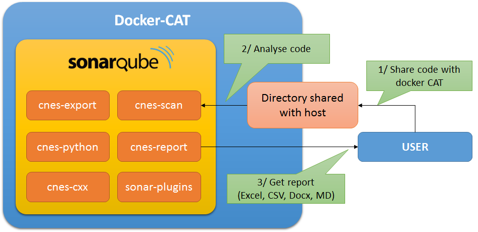

# Lequal

The LEQUAL (for *Laboratoire d'Expertise QUAlité Logiciel*) is a CNES laboratory that
create some tools to analyse code and verify its quality. All the projects are available
in their [repo](https://github.com/lequal).

The goal of all these projects is to provide some tools to do code analisys and check the
quality of a project with CNES standards. Even if it's build on CNES standards you can
use these tools to check all types of project and reconfigure them to fit your own projects.
Most of the tools are based on SonarQube and are designed to work on SonarQube 7.9LTS but they
also work with other versions of SonarQube. Please check compatibility matrix of each tool for
more information. These matrix are availables on the README file for each projects.

A all-in-one solution includes most of this tools: [Docker-CAT](CAT/how-to-use-cat). This projects
provide all the tools already configured in a virtual environment managed by Docker.

The most popular tool of this repo is the [sonar-cnes-report](https://github.com/lequal/sonar-cnes-report/releases). This tool can help
you to generate a quality report from a SonarQube project. Output can be in
Docx (Microsoft Word), XLSX (Microsoft Excel), CSV or Markdown.
It work as sonar plugin or throught the command line.

- Plugin mode is very simple to use and very simple to install. It work with the local installation of SonarQube.
- Standalone mode (usage throught command line) does not need to be installed and can be
configured with a lot of settings, you can change report templates for example. It work with
every distant installation of SonarQube and SonarCloud.

## Docker CAT - Code Analysis Tools
[Docker-CAT on Github (install / download)](https://github.com/lequal/docker-cat)
 - [user guide](CAT/how-to-use-cat)
The main tool of this repo is Docker-CAT (Code Analysis Tool). Docker-CAT is the docker version of
CAT, a tool used at CNES.

Docker-CAT is based on SonarQube and upgraded with some tools of this repo so you
can do some code analysis and verify the quality of your code. Docker-CAT also include
[sonar-cnes-report](https://github.com/lequal/sonar-cnes-report) so you can export
all results in docx, excel, markdown or csv. This all-in-one solution is configured with
CNES standards, so, if you work with CNES, you can use it to check your code.
You can also reconfigure it with your own standard if needed.

Docker cat can analyse
- C++
- Java
- Python
- Web languages (HTML, JavaScript, TypeScript, PHP, etc.)

When docker-CAT is started, every tasks can be done with the web interface. So it can be easily used by anybody. Also
if you open the sonarqube port (default:9000) in your firewall it can be used by any computer. (Users should also have
an access to the shared directory).

More information in the [user guide](CAT/how-to-use-cat).

### Tools included in Docker-CAT

<table><tr><th colspan='2'>DOCKER-CAT</th></tr>
        <tr><td>Sonarqube 6.7.4 (LTS)</td>
        <td><a href="https://github.com/lequal/sonar-cnes-scan-plugin">sonar-cnes-scan-plugin</a> 
        <em>Add a new UI in sonar to start code Analysis with CNES guidelines.</em></td></tr>
        <tr><td><a href="https://github.com/lequal/sonar-cnes-export-plugin">sonar-cnes-export-plugin</a> 
        <em>Let you export sonarqube configuration.</em></td>
        <td><a href="https://github.com/lequal/sonar-cnes-python-plugin">sonar-cnes-python-plugin</a> 
        <em>Add possibility to analyse Python code.</em></td></tr>
        <tr><td><a href="https://github.com/lequal/sonar-cnes-report">sonar-cnes-report</a>
         <em>Let you generate some reports.   Can be used as sonar-plugin or throught command line.</em></td>
        <td><a href="https://github.com/lequal/sonar-cnes-python-plugin">sonar-cnes-cxx-plugin</a> 
        <em>Let you analyse C/C++ code.</em></td></tr>
        <tr><td colspan="2">And other tools... 
        <em>There is also some other tools, but not from lequal. You can get complete list  <a href="https://github.com/lequal/docker-cat">here</a>.</em></td></tr>
</table>

## Other tools available in the repo

### i-CodeCNES and icode-cnes-plugin
i-CodeCNES is an eclipse Plugin that let you check Fortran 77, Fortran 90 and shell code. It can be combined with
icode-cnes-plugin to export issues in SonarQube.

Download and documentation:
[i-CodeCNES](https://github.com/lequal/i-CodeCNES) -
[sonar-icode-cnes-plugin](https://github.com/lequal/sonar-icode-cnes-plugin)

### sonar-cnes-report

sonar-cnes-report is a tool which can extract issues and metrics from a Sonarqube project and export them in **docx, excel, csv or markdown**. It can be used as SonarQube plugin
or (if you can't install plugins for example) you can use JAR in standalone and specify a distant Sonarqube instance.
sonar-cnes-report use sonar API and works with sonarqube 6.7 LTS and 7.9 LTS.

[Repo](https://github.com/lequal/sonar-cnes-report) - [Releases](https://github.com/lequal/sonar-cnes-report/releases) - [User guide](https://github.com/lequal/sonar-cnes-report/blob/master/README.md)

### Other tools
* [polyspace-report2excel](https://github.com/lequal/polyspace-report2excel): _Extract tables from polyspace report and copy them in excel file._
* [cnes-pylint-extension](https://github.com/lequal/cnes-pylint-extension) : _Add more checkers to pylint with CNES guidelines._
* [sonar-frama-c-plugin](https://github.com/lequal/sonar-frama-c-plugin) : _Let you import FRAMA-C results in sonar_
* [sonar-shellcheck-plugin](https://github.com/lequal/sonar-shellcheck-plugin) : _Let you import SHECLLCHECK results in sonar_
* [sonar-cnes-cxx-plugin](https://github.com/lequal/sonar-cnes-cxx-plugin) : _Execute C analysis tool and import results in Sonar_
