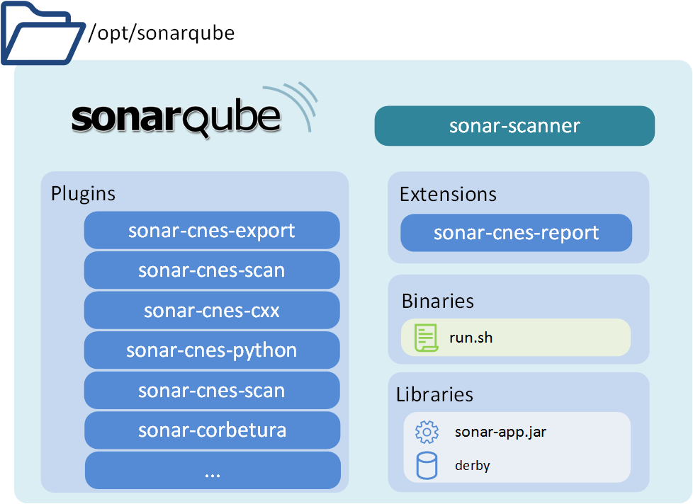
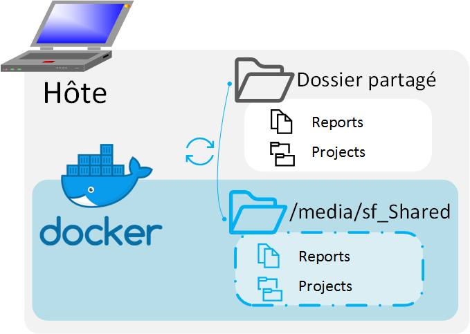
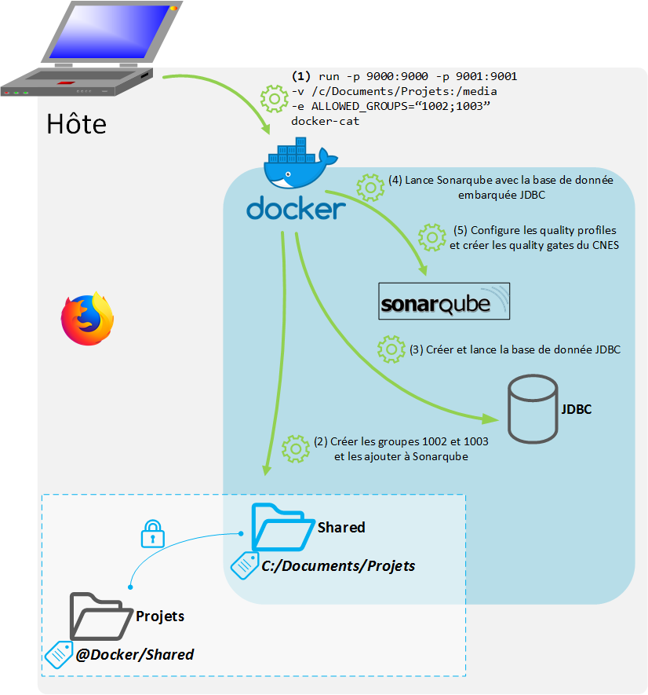

# Guide technique de docker-cat

Historiquement CAT fonctionnait sur machine virtuelle, l'outil à été porté sous
Docker. Docker est une technologie présentant un grand nombre d'avantages par
rapport à la machine virtuelle. Docker est plus leger, plus modulable et
portable.

## Caractéristiques techniques
L'ensemble des outils et de leurs version sont directement lisible dans le
[Dockerfile](https://github.com/lequal/docker-cat/blob/master/Dockerfile).


## Architecture
### Structure générale


Le **docker-cat** se découpe en 3 parties:
- La partie *boot* contenant les fichiers de configuration de SonarQube et de
  lancement de ce dernier. Cette partie se trouve dans `/tmp`
- La partie applicative (SonarQube et sa base de données embarquée).
- Le contenu partagé où se trouve le code à analyser.

### Boot


Le boot est constitué d'un fichier `init.bash`, point d'entrée. Il contient les
scripts de configuration des droits de l'utilisateur `sonarqube:sonarqube` du
conteneur. Il lance aussi la configuration de l'application SonarQube avec les
fichiers présents dans le dossier `quality-profile`.

### Application SonarQube


L'application SonarQube est fournit avec l'ensemble des plugins du Dockerfile.

Le scrit `run.sh` du dossier `Binaries` contient le script permettant  de lancer
la base de donnée `JDBC` et `sonar-app.jar`.

### Contenu partagé



Lors du lancement du conteneur, l'utilisateur choisit un dossier qui sera
accessible dans un [volume docker](https://docs.docker.com/storage/volumes/)
aussi bien en lecture qu'en écriture.

Les modifications réalisé sur ce dossier dans le conteneur se produisent aussi
sur l'hôte, ainsi, à l'extinction du conteneur, les modifications (création de
rapports, ajout de *sonar-properties*) seront persistantes.

## Build
### Les étapes du build
La construction de l'image **docker-cat** est spécifié dans le `Dockerfile`.
L'image est d'abord téléchargée sur le Docker-hub. Il s'agit d'un répertoire de
Docker officiel, ce qui garantie l'intégrité de l'image. Néanmoins, même en
utilisant cette image il est important de reconstruire l'image pour qu'elle
prenne en compte les mises à jours de sécurités des images qu'elle hérite.
L'image *sonarqube* dont hérite *docker-cat* hérite déjà de 5 autres images.


### Installation des plugins
L'installation des plugins SonarQube est simple à réaliser, il suffit simplement
de déposer les jar dans le dossier `plugins` de *sonarqube*. Dans le cas de
docker-cat ce dossier se trouve dans `/opt/sonarqube/plugins`

### Gestion des permissions
La gestion des permission est un défi important de Docker, aussi bien d'un point
de vue de la sécurité (les applications ne doivent pas sortir du cadre prévu)
que d'un point de vue fonctionnel (les tâches doivent être réalisés sans
contraintes)

Dans le cas de SonarQube, on ne lancera **jamais** l'application en `root` même
si cela peut compliquer son utilisation.

## Lancement du conteneur
### Commandes
Le conteneur doit être lancée pour la première fois avec la commande suivante:
```
docker run \
  -p 9000:9000 -p 9001:9001 \
  -v <dossier-hote>:<dossier-conteneur>:rw \
  -e ALLOWED_GROUPS="<GID>[;<GID2>;<GID3>;...]" \
  docker-cat
```

**Paramètres:**

- `-p 9000:9000` ouvre le port 9000 de la machine et le redirige sur le port
  9000 (pour communiquer avec SonarQube).
- `-p 9001:9001` ouvre le port 9001, pour communiquer avec la JDBC.
- `-v <dossier-hote>:<dossier-conteneur>:rw` va créer un volume
  `<dossier-conteneur>` rendant accessible `<dossier-hote>` en lecture-ecriture.
  - ex. sur windows: `-v /c/User/Documents/projets:/media/Sf_Shared:rw`
  - ex. sur linux: `-v /home/user/projects:/media/Sf_Shared:rw`
- `-e ALLOWED_GROUPS="<GID>[;<GID2>;<GID3>;...]` GID dans lesquelles ajouter
  l'utilisateur `sonarqube:sonarqube`

**Mieux comprendre la variable `ALLOWED_GROUPS`**

Tout utilisateur possède un **User ID** (**GID**) et un **Group ID** (**GID**).
Au lancement du conteneur il est nécessaire de choisir les groupes auquel nous
ajoutons SonarQube. Par exemple:


Les utilisateurs `alice`, `bob` et `trent` sont respectivement dans les groupes
`alice`, `bob`, `trent`. Les utilisateurs `alice` et `bob` sont aussi dans le
groupe `devs`. On donne à l'utilisateur `sonarqube` du conteneur le groupe
`devs` pour qu'il ait un accès partagé aux fichiers appartenant à ce groupe.
On l'ajoute aussi aux groupes `alice` et `bob` pour que `sonarqube` puisse
accéder à leurs fichiers. Dans cet exemple, nous ne donnerons pas à `sonarqube`
les groupes `trent` et `root` pour que leurs fichier soient pas accessibles
par l'utilisateur `sonarqube`.

Lorsque les différents groupes que l'on souhaite ajouter sont identifier, on
récupère les ids des groupes grâce à la commande
`getent group <group_name> | cut -d : -f3` ou bien en ouvrant le fichier
`/etc/passwd`

Ainsi, dans cette situation, les groupes, `alice` et `bob` ont respectivement
les **GID**, `1001` et `1002` et le groupe developpeur est `1004`. Lors du
lancement du conteneur on précisera `-e ALLOWED_GROUPS="1001;1002;1004`. On
obtient alors le résultat suivant :


Dans l'image ci-dessus, l'utilisateur `sonarqube`a accès en écriture uniquement
sur les fichiers encadrés en vert. Il s'agit uniquement des fichiers appartenant
aux groupes `1001`,`1002` et `1004` sur le conteneur, respectivement `alice`,
`bob` et `devs`. Les autres fichiers sont inaccessible à Sonarqube, ils ne
pourront être analysés.

Note : Ici, le dossier `projet-B2` n'est pas accessible à `sonarqube` mais
uniquement à `bob` car `bob` n'a pas donné les accès en écriture aux membres du
groupes mais uniquement au propriétaire du fichier (lui-même).


### Utilisation du point d'entrée
Lors du lancement du conteneur, le script `init.bash` est lancée en tant que
point d'entrée du conteneur comme précisé dans le Dockerfile
(`ENTRYPOINT ["/tmp/init.bash"]`). Ce script est utilisé après le buid  pour
tout les éléments spécifiques à l'hôte lançant le conteneur. Il permet de :

- Configurer les permissions pour l'utilisateur `sonarqube:sonarqube`.
- Lancer l'application *Sonarqube* et sa base de données.
- Configurer les *Quality profiles*.
- Créer les *Quality gates*.

### Gestion des permissions
Lors du lancement du conteneur les utilisateurs et les groupes présents sur
l'hôte ne sont pas communs, seul un utilisateur existe car il à été
préalablement créé lors du build. Il s'agit de l'utilisateur
`sonarqube:sonarqube`. Dans la fonction `allow_sonarqube()` du point d'entrée,
pour chaque identifiant précisé dans la variables `ALLOWED_GROUPS` un groupe
unix générique est créé et son GID est modifié pour correspondre à celle précisé
dans `ALLOWED_GROUPS`.

> Par exemple, pour le groupe `1003` précisé dans `ALLOWED_GROUPS` un groupe
> `group-1003` avec le **GID** `1003` sera créé sur le conteneur.

Ensuite l'utilisateur `sonarqube` est ajouté au groupe.


### Configuration des Quality Profiles

La fonction `configure-cat.bash` est lancée en parallèle du script `init.bash`
lançant *Sonarqube*.

Cette fonction vérifie periodiquement l'état de *Sonarqube*, qui passe de `INIT`
à `STARTING` puis à `UP` lors de son lancement.

Une fois *Sonarqube* à l'état `UP`, les fichiers `*-quality-profile.xml`
présents dans le dossier `/tmp/conf` du conteneur sont injectés dans *Sonarqube*
via l'API `/api/qualityprofiles/restore`.

### Configuration des Quality Gates

Contrairement aux *quality profiles* qui peuvent être importés grâce à l'API,
les *quality gates* n'ont pas cette fonctionnalité à ce jour.

Il est donc nécessaire de créer entièrement les *quality gates* du *CAT* en
utilisant les autres fonctionnalités de l'API *Sonarqube*. Ceci est réalisé par
le script `configure-cat.bash` appelé par le script `init.bash` une fois que
SonarQube est lancé.

Le script créer le *quality gate* **CNES** de la manière suivante :
- Création du quality gate **CNES**
- Selection par défaut du gate **CNES**
- Ajout des différentes conditions de succès du *quality gate* **CNES** en
appelant la fonction
`add_condition <metric_name> <metric_key> <metric_operator> <gate_id> <overleak> <metric_warnings> <metric_errors>`
avec les paramètres suivants :

| metric_name | metric_key | metric_operator | gate_id | overleak | metric_warnings | metric_errors |
|:------------------:|:----------:|:------:|:-----:|:-----:|:-----:|:-----:|
| "Blocker violations"               | blocker_violations           | NE | ${GATEID} | 0 | none | 0 |
| "Comment (%)"                      | comment_lines_density        | LT | ${GATEID} | 0 | 30  | 20 |
| "Comment (%)"                      | comment_lines_density        | LT | ${GATEID} | 1 | 0 | none |
| "Critical Issues"                  | critical_violations          | NE | ${GATEID} | 0 | none | 0 |
| "Duplicated Lines (%)"             | duplicated_lines_density     | GT | ${GATEID} | 0 | 10  | 15 |
| "Duplicated Lines on New Code (%)" | new_duplicated_lines_density | GT | ${GATEID} | 1 | 0   | 10 |
| "Major Issues"                     | major_violations             | NE | ${GATEID} | 0 | 0 | none |
| "New Major Issues"                 | new_major_violations         | GT | ${GATEID} | 1 | none | 0 |

### Lancement de Sonarqube

Le lancement de *Sonarqube* est pour l'instant identique à celui spécifié dans
le projet *docker-sonarqube* développé par *SonarSource*. Ainsi, le fichier
utilisé est le point d'entrée de la machine parente de l'image *docker-cat*, il
s'agit du script `init.bash`.

#### Vue d'ensemble



> **Etape par étape**
> 1. `docker run -p 9000:9000 -p 9001:9001 -v /c/Documents/Projets:/media:rw-e ALLOWED_GROUPS="1002;1003" docker-cat`
>   - Lance l’image docker-cat sur le port 9000 (*Sonarqube*) et 9001 (*JDBC*)
>   - Rend accessible en lecture et écriture le dossier /c/Documents/Projets dans le conteneur dans /media
>   - Indique que le l’utilisateur `sonarqube:sonarqube` doit faire partie des groupes `1002` et `1003` de l’hôte.
> 2. Créer des groupes génériques partageant les GID de l’ordinateur de l’hôte et y ajoute l’utilisateur `sonarqube:sonarqube` du conteneur.
> 3. Créer et lancer la base de donnée *JDBC*
> 4. Lancer l’application *Sonarqube*
> 5. Configurer les quality profiles et créer les quality gates du CNES


## Lancement d'une analyse
Comme pour le **CAT**, le lancement d'une analyse sous **docker-cat** se fait à
l'aide du plugin Sonar CNES Scan. La documentation d'utilisation de cet outil
est accessible sur le
[respository Github du plugin](https://github.com/lequal/sonar-cnes-scan-plugin).

### Fonctionnement
Lorsque l'analyse est lancée, plugin Sonar CNES Scan se charge d'écrire les
fichiers `sonar-properties` du projet indiqué, puis, ensuite d'ordonner au
[sonar-scanner](https://github.com/SonarSource/sonar-scanner-cli) de lancer
l'analyse sur le projet en question.

Au sein du conteneur, des liens symboliques ont été créé dans les différents
répertoires de l'installation SonarQube afin de correspondre aux paramètres
attendu par défaut. Par exemple, le répertoire `/opt/sonar` a un lien symbolique
vers `/opt/sonarqube`, l'actuelle installation de sonarqube.


## Arrêt du conteneur
### Commandes
Une fois le conteneur lancé, il peut-être arrêté grâce à la commande
`docker stop <nom_conteneur>` et redémarré avec la commande
`docker restart <nom_conteneur>`.

> **Rappel :** Pour pouvoir lancer les commandes docker, il faut que le docker deamon soit lancé (*en utilisant en `root` la commande `systemctl start docker`*). Il est aussi nécessaire qui lance le conteneur soit `root` ou appartienne au groupe `docker` (**attention**, faire partit du groupe `docker` revient à être `root` sur l'hôte).

### Persistance des données
L'arrêt simple du conteneur n'en supprime pas son contenu, ainsi lorsqu'il est
relancé grâce à la commande `restart` son état est identique à celui dans lequel
 il était au moment du `stop`.

Cela implique :
- Que la base de données garde à ce moment là les analyses lancées.

## Suppression du conteneur
Il est possible de supprimer de manière définitive le conteneur (et sa base de
données) grâce à la commande `docker rm <nom_conteneur>`.
