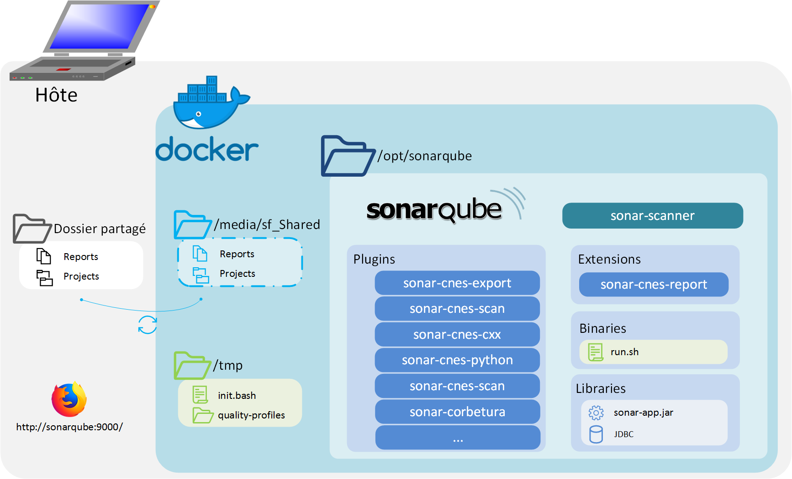
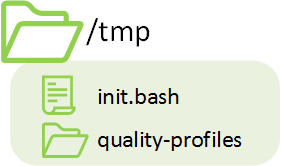

# Docker-CAT - technical guide

## Tools included
To see all tools included, you can directly check the
[Dockerfile](https://github.com/cnescatlab/docker-cat/blob/master/Dockerfile).


## Architecture
### General structure


There is 3 parts in the Docker-CAT:
- The *boot*: it contains configuration files and some scripts, it's located at `/tmp` in docker.
- *SonarQube*: The SonarQube software and the plugins, located at `/opt/sonarqube`.
- The Shared Folder: The place where you put the code to analyse, on docker, mounted on `/media/sf_Shared`.


### Boot


In the boot folder you can find the entry point of the docker and some quality profiles for SonarQube. This script authorize
SonarQube user to acces the Shared Folder.

### Application SonarQube


### Shared folder


When you start the docker, the user must choose a folder that will be accessible in docker (also see:
[docker documentation](https://docs.docker.com/storage/volumes/)). This folder should have read/write access.

When this folder is updated by Docker, it will also update folder in the host, so when you stop docker, you will
not loose the results.

## Build
### Building image
This docker image is built from the sonarqube image. Then it will install some plugins and scripts. Because
it use an official docker image, it's important to rebuild the image to include latest security updates from
SonarQube.


### Add plugins
If you want to add plugins into Docker-CAT, you can copy your jar file into `/opt/sonarqube/extensions/plugins`.
After that, if docker is running, restart it with `docker restart`

## Start docker
### Commands
At first run, you can start docker with:
```
docker run \
  -p 9000:9000 -p 9001:9001 \
  -v <host_directory>:/media/sf_Shared:rw \
  -e ALLOWED_GROUPS="<GID>[;<GID2>;<GID3>;...]" \
  docker-cat
```

**Arguments:**

- `-p 9000:9000` Open port 9000 and redirect to port 9000 in Docker (used for HTTP).
- `-p 9001:9001` Open port 9001 and redirect to port 9001 in Docker (used for JDBC).
- `-v <host_directory>:/media/sf_Shared:rw` share the host folder by creating a new volume inside Docker.
- `-e ALLOWED_GROUPS="<GID>[;<GID2>;<GID3>;...]` create a new variable used by startup script. The user `sonarqube:sonarqube`
will be a member of all specified groups.

**About allowed `ALLOWED_GROUPS`**
In linux, every user have a UID (UserID) and one or more GID(GroupID). Because SonarQube is not run as root
(and should never be run as root), sonarqube should be in the same group as users that depose code.
For example if *Alice* (UID=42;GID=1004) depose code on shared folder, Sonarqube have to be a member of group 1004
to read/update folder.


You can get GID by using: `getent group <group_name> | cut -d : -f3`.


### Docker-cat - Entry point
When you start Docker `init.bash` is runned
(`ENTRYPOINT ["/tmp/init.bash"]` in docker file). This script will:

- Configure GID and permissions for the user `sonarqube:sonarqube`.
- Start *Sonarqube*.
- Configure the *Quality profiles*.
- Create the *Quality gates*.


## Analyse code
Please refers to the [latest documentation from the github repo](https://github.com/cnescatlab/docker-cat?tab=readme-ov-file#using-classical-way) for more information about analyzing code.

Please note that the UI is deprecated and you may use the "classical way".

You can also do a standard Sonarqube analysis at this step.

## Stop container
Once the container is started, it could be stopped using `docker stop <container_name>`
and restarted with `docker restart <container_name>`.

> **Reminder :** In order to launch docker commands, the docker daemon has to be started (*as `root` using `systemctl start docker`*).
> You also have to start the container with `root` or with user that belongs to the `docker` group (**Watch out !** Belonging to the `docker` group is the same as being `root` on the host).

### Data storage
Stopping a container does not remove its content, so that when it is restarted (thanks to `docker restart`), it will be in the exact same state than before being stopped.
Indeed, the database stores the results of your analysis.

## Remove the container
You can permanently remove a container (and its content/data) using `docker rm <container_name>`.
