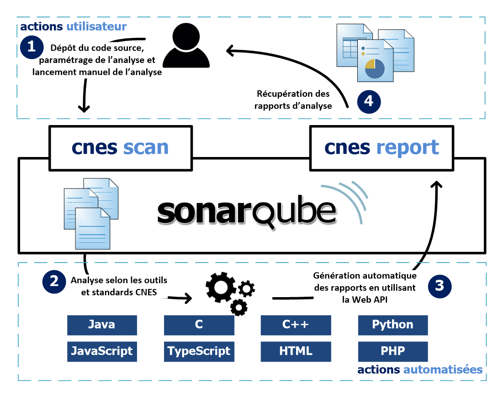
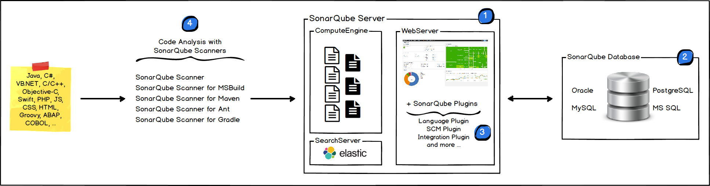
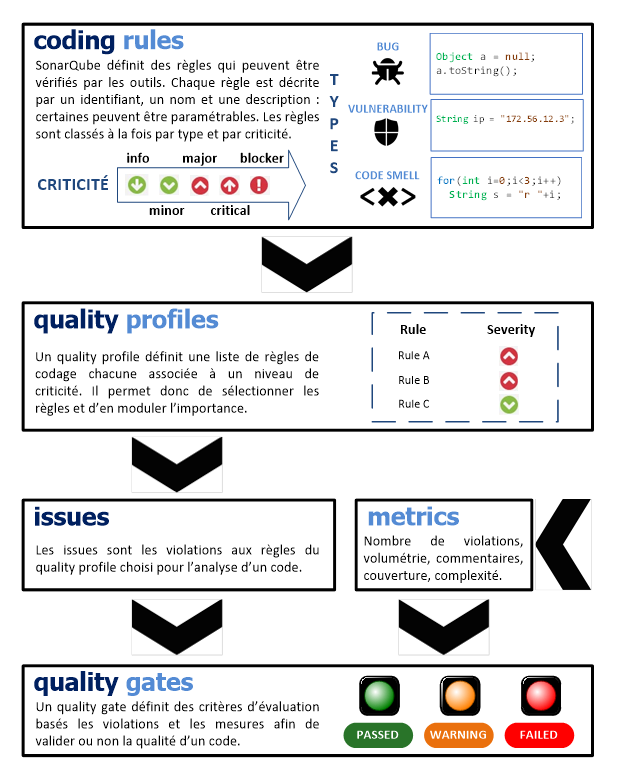

# Docker CAT - Code Analysis Tools

## Presentation

Docker-CAT (Code Analysis Tool) is a major tool in our repository, which is embedded and released in a Docker Image.

It is based on SonarQube, and upgraded by some of our tools so you
can easily analyse code and verify its quality.
For instance, Docker-CAT includes [sonar-cnes-report](https://github.com/lequal/sonar-cnes-report) to add the ability to export all results in docx, excel, markdown or csv. 
This all-in-one solution is configured with CNES standards by default, so, if you work with CNES, you can use it directly to check your code. Otherwise, feel free to insert your own Quality Profiles.

Docker cat can analyse the following languages :
- C/C++
- Java
- Python
- Web languages (HTML, JavaScript, TypeScript, PHP, etc.)
- and all others languages supported by default on SonarQube

In Docker-CAT, every task can be done with the web interface, so that it can be easily used by anybody. Moreover, if you open the sonarqube port (default:9000) in your firewall, it can be accessed by any computer. (Users should also have an access to the shared directory).

Approximately, it works as follows :
  1. The user puts project source code inside a directory shared with Docker.
  2. Through the web interface, he uses the [cnes-scan](https;//github.com/lequal/sonar-cnes-plugin) plugin.
  3. After completing the form, he can launch the analysis.
  4. The results will then be available inside the web interface.
  5. The user will also be able to generate reports in various format (docx, excel, etc.), thanks to the [cnes-report](https://github.com/lequal/sonar-cnes-report).

The following picture sums up the use of Docker-CAT.

More details in the [user guide](tools/how-to-use-cat).
More technical details in the [technical guide](tools/cat-tech-guide).

### Tools included in Docker-CAT

<table><tr><th colspan='2'>DOCKER-CAT</th></tr>
        <tr><td>Sonarqube 6.7.4 (LTS) or 7.9 (LTS)</td>
        <td><a href="https://github.com/lequal/sonar-cnes-scan-plugin">sonar-cnes-scan-plugin</a> 
        <em>Add a new UI in sonar to start code Analysis with CNES guidelines.</em></td></tr>
        <tr><td><a href="https://github.com/lequal/sonar-cnes-export-plugin">sonar-cnes-export-plugin</a> 
        <em>Let you export sonarqube configuration.</em></td>
        <td><a href="https://github.com/lequal/sonar-cnes-python-plugin">sonar-cnes-python-plugin</a> 
        <em>Add possibility to analyse Python code.</em></td></tr>
        <tr><td><a href="https://github.com/lequal/sonar-cnes-report">sonar-cnes-report</a>
         <em>Let you generate some reports.   Can be used as sonar-plugin or throught command line.</em></td>
        <td><a href="https://github.com/lequal/sonar-cnes-python-plugin">sonar-cnes-cxx-plugin</a> 
        <em>Let you analyse C/C++ code.</em></td></tr>
        <tr><td><a href="https://github.com/lequal/sonar-frama-c-plugin">sonar-frama-c-plugin</a>
         <em>Let you import Frama-C results in SonarQube.</em></td>
        <td><a href="https://github.com/lequal/sonar-icode-cnes-plugin">sonar-icode-cnes-plugin</a> 
        <em>Let you import i-Code results in SonarQube.</em></td></tr>
        <tr><td colspan="2">And other tools... 
        <em>There is also some other tools, but not from lequal. You can get complete list  <a href="https://github.com/lequal/docker-cat">here</a>.</em></td></tr>
</table>

## Architecture

The [SonarQube](https://www.sonarqube.org) platform is made of 4 major components :

- The **web server**: which combines given informations to generate readable dashboards to be used by developers and managers
- The **database** which stores SonarQube's configuration and also projects' data
- Several **plugins** installed on the server in order to enhance analysis of multiple programming languages
- One (or more) **SonarQube Scanner** on the build server in order to perform a quality analysis on source code (may be integrated inside a CI platform)

You can find more details on the [SonarQube official documentation](https://docs.sonarqube.org/display/SONAR/Architecture+and+integration).

## Quality with SonarQube

The picture below shows the key concepts introduced by SonarQube, which are important in order to understand the results of your analysis.

